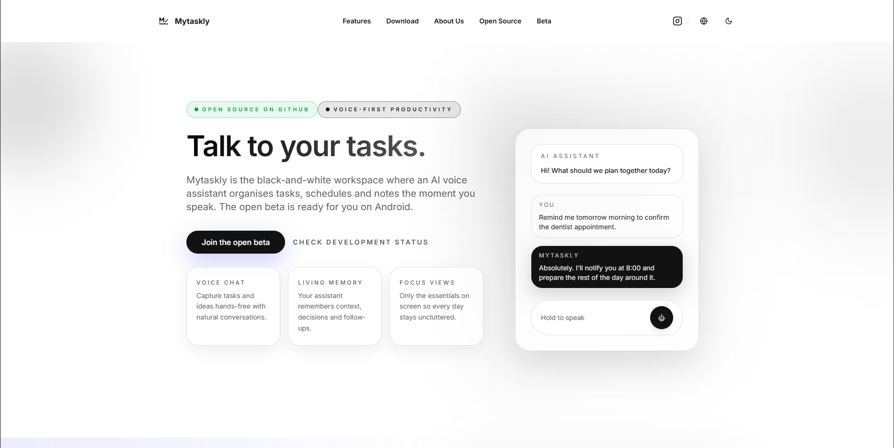

# MyTaskly Site

<!-- Placeholder for a hero screenshot of the site -->
<!-- Add an updated screenshot here to showcase the live experience. -->

[](https://vercel.com/gabry848s-projects/v0-my-taskly-site)
[](https://v0.dev/chat/projects/D3ITZ8btAED)



## Overview
MyTaskly is a modern productivity experience that blends a clean Next.js frontend with a polished design system powered by Tailwind CSS and Radix UI. The site shares product storytelling, a public roadmap, beta access options, and member-area entry points, with deployments continuously delivered via Vercel.

## Features
- **Engaging product storytelling** for the MyTaskly experience, roadmap, and open-source repos.
- **Beta waitlist flows** and member-area access with device-friendly navigation, including mobile.
- **Performance-oriented UI** leveraging server components, optimized assets, and accessible Radix primitives.
- **Multi-language readiness** through centralized locale strings and reusable components.

## Tech Stack
- **Framework:** Next.js 15 with App Router
- **Language:** TypeScript + React 18
- **Styling:** Tailwind CSS with `tailwind-merge` and `tailwindcss-animate`
- **UI Toolkit:** Radix UI primitives, lucide-react icons, and custom components
- **Forms & Validation:** `react-hook-form` with Zod resolvers
- **Tooling:** pnpm/npm scripts, ESLint (`next lint`), and `next-sitemap`
- **Hosting:** Vercel (CI/CD from the main branch)

## Getting Started
1. **Install dependencies** (pnpm recommended):
   ```bash
   pnpm install
   ```
   Or use npm:
   ```bash
   npm install
   ```
2. **Run the development server**:
   ```bash
   pnpm dev
   ```
   The app will be available at [http://localhost:3000](http://localhost:3000).
3. **Run checks** before committing:
   ```bash
   pnpm lint
   pnpm build
   ```

## Project Structure
- `app/` – Next.js app router pages, layouts, and client/server components
- `components/` – Shared UI elements and compositions
- `hooks/` – Reusable React hooks and context helpers
- `styles/` – Global styles and Tailwind configuration
- `public/` – Static assets, icons, and manifest files
- `lib/` – Utilities, configuration helpers, and shared logic

## Environment & Configuration
- **Environment variables:** Configure any required secrets via `.env.local` for local development (see Vercel project settings for deployed values).
- **Analytics & performance:** Integrations for Vercel Analytics and Speed Insights are available; ensure the respective environment values are set when deploying.
- **Sitemap:** `next-sitemap` runs after builds to generate SEO-friendly sitemaps.

## Deployment
Deploys are automated on Vercel. Push to the default branch to trigger a new build, or deploy manually via the Vercel dashboard linked above.

## Contributing
Contributions and feedback are welcome. Please open an issue or submit a pull request with clear context and testing notes.

---

Maintained with ❤️ for the MyTaskly community.
